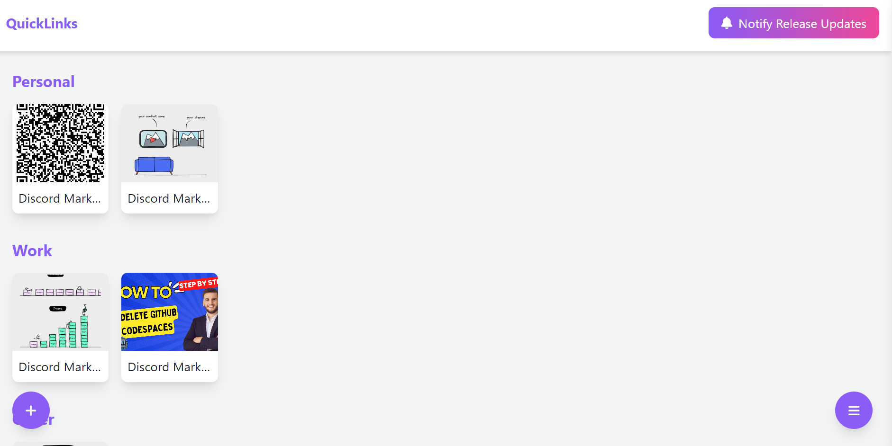
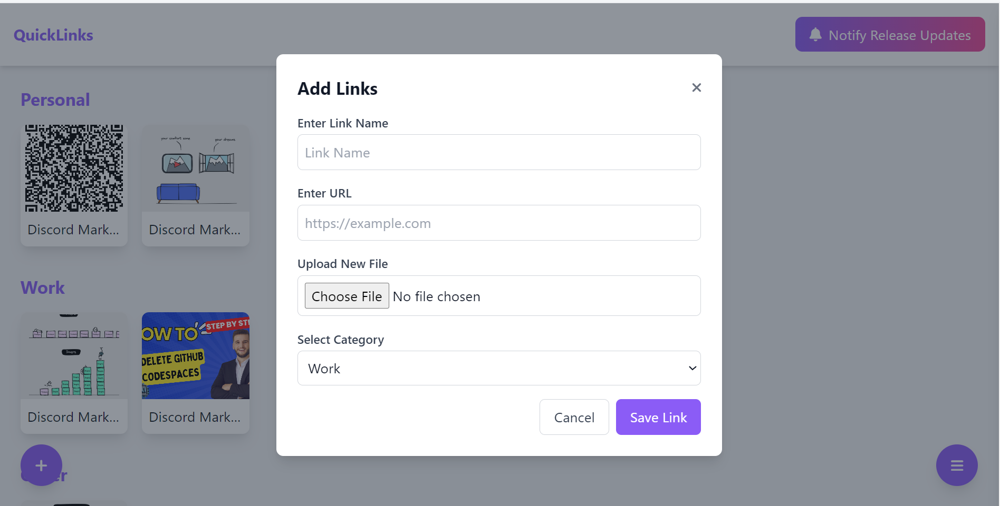
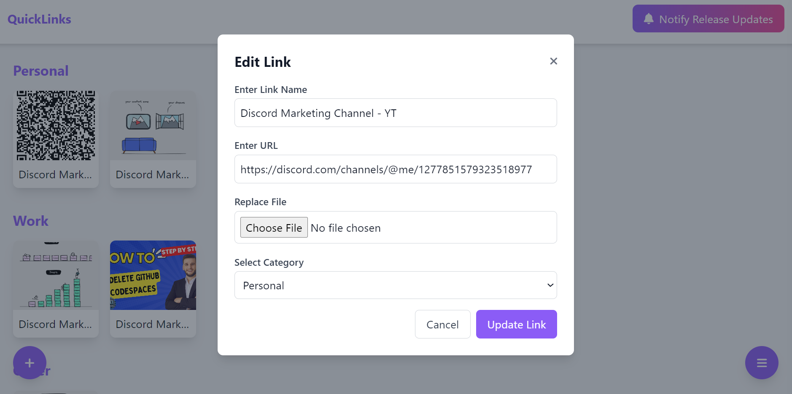
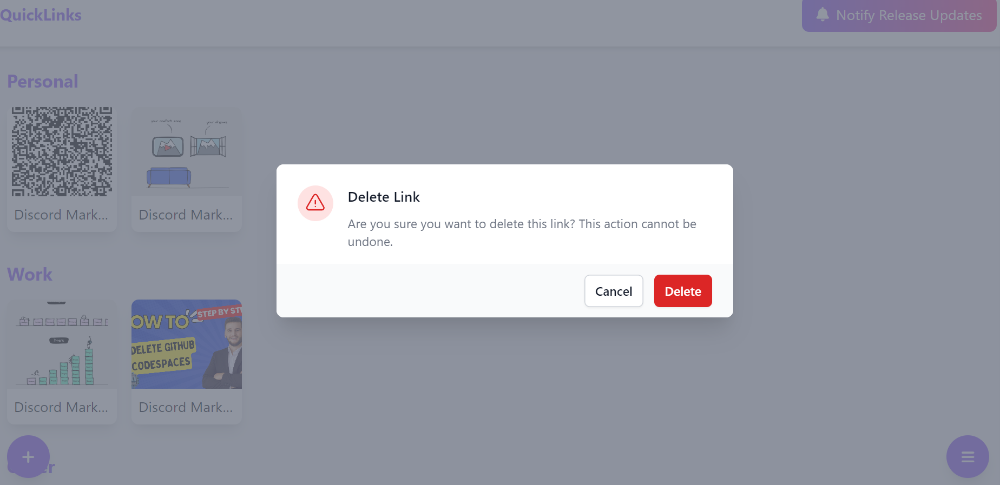
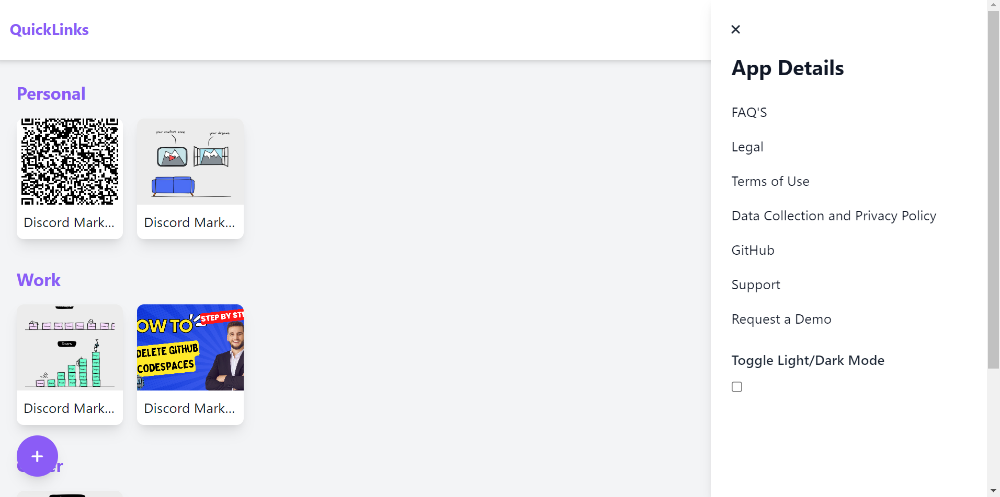

# QuickLinks Bookmark Manager

QuickLinks is a simple and efficient bookmark management application that allows users to save, categorize, edit, and delete their favorite links. The application also features a light/dark mode toggle and a sidebar with app details, FAQs, legal information, and more.

## Features

- **Bookmark Management**: Add, edit, and delete bookmarks easily.
- **Categorization**: Organize bookmarks into categories.
- **Drag and Drop Interface**: Reorder bookmarks within categories.
- **Light/Dark Mode Toggle**: Switch between light and dark themes.
- **App Details Sidebar**: Access app details, FAQs, legal information, and more.
- **Data Persistence**: Bookmarks are stored in local storage for persistence across sessions.
- **Mobile Friendly**: Responsive design for use on mobile devices.

## Screenshots

### Home Page with Filled Data
The home page displays bookmarks organized by categories. You can add, edit, or delete bookmarks directly from this page.

### Add a New Link
Easily add a new bookmark by providing the link name, URL, category, and an optional icon.

### Edit a Link
Edit existing bookmarks. The form will pre-fill with the current bookmark's data, allowing for easy updates.

### Delete a Link
Delete bookmarks with a confirmation modal to prevent accidental deletions.

### App Details Sidebar
Access additional features like FAQs, legal information, and more from the sidebar.

## Live Demo

Check out the live demo of QuickLinks here: [QuickLinks Live Demo](https://sundarsharma332.github.io/links/)
